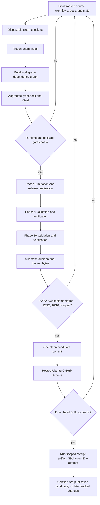

# Phase 10: Close v0.1 release certification and evidence gaps - Research

**Researched:** 2026-08-11
**Domain:** Runtime terminal control, generated-state hygiene, release evidence, hosted-CI certification, and milestone closure
**Confidence:** HIGH

<user_constraints>
## User Constraints (from CONTEXT.md)

### Locked Decisions

#### Terminal action contract

- **D-10-01 — Keep and implement `ActionDefinition.terminal`.** The field and its documented promise remain in the v0.1 public surface. Removing or documenting around the dead behavior is not acceptable.
- **D-10-02 — Handler entry commits the terminal boundary.** Once a terminal handler is entered, the occurrence is terminal regardless of whether the handler ultimately succeeds or fails. Let the handler settle, then stop; do not keep the session alive because the terminal effect's final external state may be uncertain.
- **D-10-03 — A terminal occurrence makes its entire batch response-silent.** Calls that completed earlier retain their application effects, but no result envelope from that batch reaches the agent. The terminal call emits no result, and no later call in the batch enters its handler.
- **D-10-04 — Preserve the app-authored failure boundary before teardown.** If the terminal handler returns a failure, await the existing immutable app-authored outcome presentation and then stop. Never expose the terminal result to the agent and never let agent-authored narration replace the application outcome.

#### Astro generated declarations and release inputs

- **D-10-05 — `.astro` declarations are generated state, not release inputs.** Untrack the two declarations introduced by the milestone-audit commit and regenerate them from committed source and pinned tooling when Astro runs. Do not place their bytes in Phase 9 release manifests or seals.
- **D-10-06 — Scope the exclusion to the existing harness.** Ignore and prohibit tracked files anywhere under `examples/adapter-ssr/.astro/`; do not introduce a repository-wide `.astro/` rule for hypothetical future projects.
- **D-10-07 — Certification starts without generated-state assumptions.** Run the authoritative proof in a disposable clean checkout/snapshot with no preexisting `.astro/`. A developer's ignored local `.astro/` cache is irrelevant and must neither satisfy nor block certification.
- **D-10-08 — Prove regeneration behavior, not generated-byte identity.** Require pinned-tool regeneration, successful Astro check/build, and zero tracked paths under the harness-local `.astro/` directory. Do not hash or compare the generated declarations across runs.

#### Release-candidate certification threshold

- **D-10-09 — Hosted CI is a release gate.** The exact candidate commit must pass the real GitHub Actions workflow, including its Ubuntu jobs and the same package/release command chain used for certification. Local CI-equivalent execution alone cannot complete this phase.
- **D-10-10 — Certification precedes registry publication.** Phase 10 proves exact tarballs, hosted workflow execution, OIDC/trusted-publishing configuration, permissions, and release wiring. Actual npm publication and provenance inspection require a later, explicit release approval and are not performed by this phase.
- **D-10-11 — Bind certification to one exact clean commit.** Generate every seal, validation record, verifier report, and audit result only after source, tests, workflows, documentation, and bookkeeping are final. Run hosted CI on that SHA. Any later tracked release-input change invalidates the certification and requires regeneration.
- **D-10-12 — No gap waivers.** Completion requires 62/62 requirements, 9/9 phase verification, 12/12 integration links, 10/10 flows, and a Nyquist-compliant Phase 9. Evidence-only partials, documented technical exceptions, or owner overrides cannot substitute for those scores.

#### Legacy human checks and evidence debt

- **D-10-13 — Repair null declarations structurally.** `buildCatalog([null])` must enter the normal aggregate build-diagnostic path rather than escape as a raw `TypeError`. Since there is no action name to report, identify the offending declaration by array index and provide an actionable fix without inventing a name.
- **D-10-14 — Automated actionability evidence is sufficient.** Developer-facing build diagnostics and `explain()` output do not require a separate subjective human prose-approval checkpoint. Mechanically require action or declaration-index identification, stable distinct codes, nonempty actionable fixes, and the expected structured explanation fields.
- **D-10-15 — Close the Phase 4 dispatch-stub note as superseded.** Cite the real Phase 6 dispatcher's result-normalization tests and mutation evidence. Do not recreate or add tests for an obsolete Phase 4 stub solely to close its historical verifier note.
- **D-10-16 — Correct live prose without rewriting history.** Fix inaccurate or ambiguous comments that ship in package artifacts. Preserve historical validation and verification records as records of what happened, adding explicit correction notes or addenda rather than silently rewriting their original claims.

#### Carried-forward release constraints

- Phase 9's exact core/React/Svelte tarball, singleton, SSR, Svelte consent-drift, adapter-budget, workflow, security, and mutation proofs remain load-bearing. Repair and regenerate them; do not weaken or replace them with source-only evidence.
- Phase 8's sealed mutation, release, validation, security, and verification records remain immutable inherited evidence. Phase 10 must preserve their required byte identities while rebuilding Phase 9 and milestone evidence around final inputs.
- The explicit `jsonSchema` escape hatch remains part of the public contract. Current source already attempts to snapshot explicit and derived schemas into stable data-only graphs; planning must reproduce the audit's claimed SEC-03 channel against current bytes, repair it only if still live, and otherwise close the stale verifier/ledger evidence with an independent re-verification.
- Missing `requirements-completed` frontmatter, Phase 9 verifier/validation metadata, ROADMAP/STATE drift, and final audit regeneration are required certification work, not grounds for changing already-delivered product behavior.

### the agent's Discretion

- Internal terminal-control representation, module boundaries, safe diagnostic wording, test identifiers, and mutation layout, provided D-10-01 through D-10-04 and existing cancellation/dedup/outcome invariants are mechanically proven.
- Exact structured issue code and index wording for an unreadable declaration, provided it uses the ordinary aggregate diagnostic channel and supplies an actionable fix.
- Exact separation of Phase 9 retroactive validation/verification steps from Phase 10's final integration verification, provided Phase 9 receives canonical compliant records and the final milestone audit is bound to the exact candidate commit.
- Exact implementation of ordinary-pnpm versus authenticated-mutation-child environment recognition, provided ambient authority remains stripped and every existing hostile-environment control stays discriminating.

### Deferred Ideas (OUT OF SCOPE)

- Actual npm publication, registry provenance inspection, and any release tag are a separately approved release ceremony after Phase 10 certifies the candidate.
- Checksum/signature verification for the local Node-floor download remains previously accepted post-v0.1 hardening unless the hosted CI or final audit demonstrates it is now release-blocking.
- New adapters, transports, server handlers, devtools, UI, and v2 consent/server-verification capabilities remain outside this release-closure phase.
</user_constraints>

## Summary

Phase 10 should be planned as one ordered certification transaction, not as a loose collection of documentation repairs. The runtime work is bounded: record terminality at the exact handler-entry boundary, preserve the handler's settlement and existing application-owned failure presentation, suppress the entire occurrence response, then synchronously enter the existing stopped state without awaiting the current pump's own drain. The catalog repair is similarly narrow: validate each declaration element before reading `.name` and aggregate a stable index-addressed issue. Both changes must extend the existing test and mutation architecture rather than introduce new public result fields or a second control system. [VERIFIED: Phase 10 CONTEXT.md; `packages/concierge/src/dispatch.ts`; `packages/concierge/src/concierge.ts`; `packages/concierge/src/session.ts`; `packages/concierge/src/catalog.ts`]

The release path has a newly verified blocker that is more concrete than the milestone audit's local-only concern. GitHub Actions run `31513847865` on audit commit `e41276c…` installed successfully on Ubuntu but failed at the aggregate `pnpm typecheck` step because the React and Svelte adapters resolve the core package's built declarations and CI had not built the core first. The current CI and release-verification order therefore cannot certify a clean checkout. Change the clean-checkout sequence to frozen install → build → aggregate typecheck → test → release checks, update the static workflow contract and negative controls in the same task, then prove the corrected workflow on the exact final SHA. [VERIFIED: GitHub Actions run 31513847865; `.github/workflows/ci.yml`; `.github/workflows/release.yml`; `scripts/phase-09-workflow-check.mjs`]

The final evidence sequence must avoid a self-referential SHA. Finish and commit all tracked source, workflows, generated Phase 9 ledgers, validation/verification documents, requirement metadata, ROADMAP/STATE synchronization, and the regenerated milestone audit first. Push that immutable commit, let hosted CI produce run-scoped evidence containing `github.sha`, `github.run_id`, and `github.run_attempt`, and do not create another tracked release-input commit afterward. GitHub exposes workflow runs by head SHA and preserves run artifacts independently of Git, which makes the hosted receipt both exact and non-circular. [CITED: https://docs.github.com/en/rest/actions/workflow-runs?apiVersion=2026-03-10] [CITED: https://docs.github.com/en/actions/concepts/workflows-and-actions/workflow-artifacts]

**Primary recommendation:** Implement and prove runtime closure first, repair the Phase 9 evidence generator and clean-checkout workflow second, synchronize all planning/audit records on final bytes third, and use one successful hosted run artifact as the immutable certification receipt for the final candidate SHA. [VERIFIED: Phase 10 CONTEXT.md; `.planning/v0.1-MILESTONE-AUDIT.md`; GitHub Actions run 31513847865]

## Architectural Responsibility Map

| Capability | Primary Tier | Secondary Tier | Rationale |
|------------|-------------|----------------|-----------|
| Terminal handler-entry recognition and serial batch short-circuit | API / Backend (core runtime) | — | The dispatcher owns serial handler entry and correlated batch rows; adapters and transports must not own terminal policy. [VERIFIED: `packages/concierge/src/dispatch.ts`; Phase 6 and Phase 10 CONTEXT.md] |
| Outcome-before-stop and response suppression | API / Backend (session runtime) | Browser / Client transport boundary | The session owns FIFO occurrence work, outcome presentation, response attempts, and stop/drain; the transport only receives what the session elects to emit. [VERIFIED: `packages/concierge/src/session.ts`; Phase 7, Phase 8, and Phase 10 CONTEXT.md] |
| Declaration validation and SEC-03 schema detachment | API / Backend (catalog assembly) | — | Catalog construction owns aggregate declaration issues and substitutes detached schema data before the public catalog is frozen. [VERIFIED: `packages/concierge/src/catalog.ts`; `packages/concierge/src/json-schema.ts`] |
| Astro declaration regeneration | Build / Tooling | CDN / Static output | Astro's pinned check/build commands create harness-local generated state; Git must exclude it and certification must recreate it from committed inputs. [VERIFIED: `examples/adapter-ssr/package.json`; `pnpm-lock.yaml`] [CITED: https://docs.astro.build/en/reference/cli-reference/] |
| Tarball, mutation, budget, SSR, and release seals | Build / Tooling | Package consumers | Existing Phase 9 scripts own isolated tarball and mutant evidence; the planner should extend those generators so final ledgers share one tracked-input model. [VERIFIED: `scripts/phase-09-mutation-battery.mjs`; `scripts/phase-09-package-check.mjs`; Phase 9 CONTEXT.md] |
| Exact-SHA hosted certification | External CI service | Build / Tooling | GitHub Actions executes the clean Ubuntu checkout; a run-scoped receipt binds the successful run to the candidate SHA without changing that SHA. [VERIFIED: `.github/workflows/ci.yml`; GitHub Actions run 31513847865] [CITED: https://docs.github.com/en/rest/actions/workflow-runs?apiVersion=2026-03-10] |
| Milestone requirement, integration, flow, and Nyquist closure | Planning / Evidence | Git | GSD's milestone audit consumes per-phase summaries, validation, verification, requirements, ROADMAP, and STATE; these must agree on final tracked bytes. [VERIFIED: installed GSD audit workflow; `.planning/v0.1-MILESTONE-AUDIT.md`] |

## Standard Stack

No new external package is needed or recommended for Phase 10. Keep the frozen existing workspace and make the evidence tooling consume the already-pinned toolchain. [VERIFIED: `package.json`; `pnpm-lock.yaml`]

### Core

| Library / Tool | Pinned Version | Registry Status | Purpose | Why Standard Here |
|----------------|----------------|-----------------|---------|-------------------|
| Node.js | `>=22.12.0`; workstation `24.14.1` | Runtime, not npm package | Workspace scripts, tests, evidence generators | This is the repository engine contract and the language runtime used by all current certification scripts. [VERIFIED: `package.json`; local `node --version`] |
| pnpm | `11.17.0` | Published 2026-07-23; registry latest `11.21.0` on research date | Frozen workspace install and public package-gate invocation | The repository pins this exact package-manager version; certification must not opportunistically upgrade it. [VERIFIED: npm registry; `package.json`] |
| TypeScript | `7.0.2` | Published 2026-07-08; registry latest `7.0.2` | Public/type-test contracts | It is the pinned root compiler and current exact type surface validator. [VERIFIED: npm registry; `package.json`] |
| Vitest | `4.1.10` | Published 2026-07-06; registry latest `4.1.10` | Runtime, integration, and mutation-killer tests | The existing multi-project test configuration already covers core, SSR artifact, React, and Svelte environments. [VERIFIED: npm registry; `package.json`; `vitest.config.ts`] |
| tsdown | `0.22.14` | Published 2026-07-23; registry latest `0.22.14` | Core and adapter builds | The package build scripts already use this pinned bundler. [VERIFIED: npm registry; package manifests] |
| Astro | `7.2.0` | Published 2026-08-06; registry latest `7.2.1` | SSR harness check/build and generated declaration recreation | Keep the locked version because D-10-08 requires pinned-tool regeneration rather than a toolchain upgrade. [VERIFIED: npm registry; `examples/adapter-ssr/package.json`; `pnpm-lock.yaml`] |
| `@astrojs/check` | `0.9.10` | Published 2026-07-27; registry latest `0.9.10` | Astro type/content validation | Astro documents `astro check` as the separate error-checking command because `astro build` does not perform type checking. [VERIFIED: npm registry; `examples/adapter-ssr/package.json`] [CITED: https://docs.astro.build/en/guides/typescript/] |
| GitHub Actions | Repository workflows | Hosted service | Ubuntu clean-checkout release gate and receipt | D-10-09 makes the hosted workflow authoritative; local emulation is supporting evidence only. [VERIFIED: Phase 10 CONTEXT.md; `.github/workflows/ci.yml`; `.github/workflows/release.yml`] |

### Supporting

| Tool / Asset | Version / Location | Purpose | When to Use |
|--------------|--------------------|---------|-------------|
| Existing Phase 9 mutation/release generator | `scripts/phase-09-mutation-battery.mjs` | Rebuild mutation, release, validation, security, and seal evidence transactionally | Extend for Phase 10 mutants and repaired Phase 9 metadata; do not create a parallel generator. [VERIFIED: script source; Phase 10 CONTEXT.md] |
| Existing secure environment helper | `scripts/phase-09-secure-environment.mjs` | Strip ambient credentials/config and construct allowlisted child environments | Use for ordinary pnpm and authenticated nested mutation-child classification. [VERIFIED: script source; Phase 9 security evidence] |
| GSD registered handlers | installed `gsd-sdk` | Synchronize phase progress, ROADMAP, STATE, validation, verification, and milestone audit | Use registered handlers instead of hand-editing status counters. [VERIFIED: installed GSD workflow and `gsd-sdk query phases.list`] |
| GitHub CLI | `2.89.0`, authenticated | Push/query the exact candidate run and inspect job conclusions | Use after the final candidate commit; bind one explicit run ID and attempt to its exact head SHA. [VERIFIED: local `gh --version`; `gh auth status`; GitHub Actions run query] |

### Alternatives Considered

| Instead of | Could Use | Tradeoff |
|------------|-----------|----------|
| Existing Phase 9 evidence generator | A new Phase 10 certification script | Reject: two input manifests/seal authorities would make final-byte ordering harder to reason about and contradict the locked instruction to extend existing assets. [VERIFIED: Phase 10 CONTEXT.md] |
| Private internal terminal control result | A new public `terminal` field on `ActionResult` or batch rows | Reject: it widens the v0.1 surface and leaks runtime control into agent-visible data; existing public result/type shapes are load-bearing. [VERIFIED: Phase 6 and Phase 10 CONTEXT.md; `packages/concierge/src/types.ts`] |
| Ignored, regenerated `.astro/` state | Committed generated declarations or deterministic byte hashes | Reject: D-10-05 through D-10-08 explicitly require zero tracked paths and behavior proof, not byte identity. [VERIFIED: Phase 10 CONTEXT.md] |
| Run-scoped hosted receipt artifact | Commit a run ID into the candidate after CI | Reject: committing the receipt changes the SHA and invalidates the run-to-candidate binding. GitHub artifacts avoid this circularity. [CITED: https://docs.github.com/en/actions/concepts/workflows-and-actions/workflow-artifacts] |

**Installation:**

```bash
corepack pnpm install --frozen-lockfile
```

This is restoration of the existing lockfile, not authorization to add or update dependencies. [VERIFIED: `package.json`; `pnpm-lock.yaml`]

**Version verification:** Registry versions and publish timestamps above were checked with `npm view <package> version` and `npm view <package> time --json` on 2026-08-11. The candidate must use pinned versions even where a newer registry release exists. [VERIFIED: npm registry]

## Package Legitimacy Audit

Not applicable to dependency selection: Phase 10 adds no package and authorizes no lockfile update. Its clean-checkout `pnpm install --frozen-lockfile` only restores the already-reviewed committed dependency graph, so there is no newly recommended package on which to run the slopcheck admission gate. [VERIFIED: Phase 10 CONTEXT.md; `package.json`; `pnpm-lock.yaml`]

## Architecture Patterns

### System Architecture Diagram



The build precedes the aggregate typecheck because the clean hosted checkout currently fails when adapters resolve the not-yet-built core package; the remainder of the diagram enforces D-10-11's final-byte ordering and the non-circular hosted receipt. [VERIFIED: GitHub Actions run 31513847865; Phase 10 CONTEXT.md] [CITED: https://docs.github.com/en/actions/concepts/workflows-and-actions/workflow-artifacts]

### Recommended Project Structure

```text
packages/concierge/src/
├── concierge.ts            # internal dispatch facade and per-call terminal execution state
├── dispatch.ts             # serial internal batch outcome and public response suppression
├── session.ts              # outcome-before-stop and zero-response terminal occurrence
├── catalog.ts              # indexed declaration validation and schema substitution
└── json-schema.ts          # existing data-only schema snapshot boundary
packages/concierge/test/    # focused runtime, catalog, session, and negative tests
scripts/
├── phase-09-package-check.mjs
├── phase-09-secure-environment.mjs
├── phase-09-contract-check.mjs
├── phase-09-workflow-check.mjs
└── phase-09-mutation-battery.mjs
.planning/phases/09-react-and-svelte-adapters/
├── 09-VALIDATION.md        # regenerated canonical Nyquist ledger
└── 09-VERIFICATION.md      # new independent phase verifier
.planning/phases/10-close-v0-1-release-certification-and-evidence-gaps/
├── 10-VALIDATION.md
└── 10-VERIFICATION.md
```

These are existing ownership seams; the two verifier files and Phase 10 ledgers are the planned evidence additions. [VERIFIED: codebase tree; `.planning/v0.1-MILESTONE-AUDIT.md`; installed GSD workflow]

### Pattern 1: Private Internal Batch Outcome, Stable Public Surface

**What:** Split the internal occurrence result from the public batch result. The internal result carries frozen completed rows plus `terminalEntered` and terminal failure state; the public `dispatchBatch()` facade returns the ordinary rows only for a nonterminal batch and a frozen empty array for any batch whose terminal handler entered. Record terminal entry immediately before the handler call, not after success. [VERIFIED: D-10-01 through D-10-04; `packages/concierge/src/concierge.ts`; `packages/concierge/src/dispatch.ts`]

**When to use:** Use the internal outcome only between core dispatcher and session. Keep `ActionResult`, public batch-row types, direct `dispatch()` Promise identity, and barrel exports unchanged. [VERIFIED: Phase 6 and Phase 10 CONTEXT.md; `packages/concierge/src/types.ts`]

**Example:**

```typescript
// Source: recommended internal pattern derived from the existing dispatcher/session seam.
type DispatchExecutionState = {
  terminalEntered: boolean;
};

type InternalBatchOutcome = Readonly<{
  rows: readonly DispatchBatchRow[];
  terminalEntered: boolean;
  terminalFailed: boolean;
}>;

// The marker is set at the commit boundary, before invoking hostile app code.
if (actionSnapshot.terminal) executionState.terminalEntered = true;
const result = await handler(input, context);

// The serial executor stops only after the entered handler settles.
if (executionState.terminalEntered) break;

// The public facade exposes no row from the entire terminal batch.
return internal.terminalEntered ? EMPTY_BATCH_ROWS : internal.rows;
```

The exact internal representation is discretionary; a private companion API or private symbol/WeakMap patterned after existing non-public metadata is acceptable. What must be tested is the observable boundary, exact Promise/dedup identity, and absence of new public fields. [VERIFIED: Phase 10 CONTEXT.md; `packages/concierge/src/consent-profile.ts`; Phase 6 CONTEXT.md]

### Pattern 2: Outcome Barrier, Then Non-Blocking Stop Transition

**What:** Let the terminal handler settle. If the established internal rows produce the application-authored failure outcome, await that existing immutable presentation. Then synchronously enter stopped state and start cleanup/drain without awaiting the cached stop Promise from inside the currently active pump; return without calling the agent response sink. [VERIFIED: D-10-02 through D-10-04; `packages/concierge/src/session.ts`; Phase 7 and Phase 8 CONTEXT.md]

**Why:** The current stop drain waits for active pump work to unwind. Awaiting that same drain from within `runWork` would create a self-dependency; initiating the cached stop and allowing `finally` to unwind preserves the existing stop Promise contract. [VERIFIED: `packages/concierge/src/session.ts`]

**Example:**

```typescript
// Source: recommended composition of the existing outcome and stop primitives.
const batch = await dispatchOccurrenceInternally(calls, signal);

if (batch.terminalEntered) {
  const failure = deriveExistingFailureOutcome(batch.rows);
  if (failure) await presentOutcome(failure);
  void stopNow(); // enter stopped state now; do not await the current pump's drain
  return;         // zero respond() attempts for the occurrence
}

for (const row of batch.rows) await respond(row);
```

Stopping must occur in a `finally`-equivalent path around outcome presentation so an outcome sink rejection or interruption cannot leave a terminal session alive. Admission should be latched while the outcome is pending so queued work cannot begin between handler settlement and stop entry. [VERIFIED: D-10-02 through D-10-04; Phase 7 stop/drain constraints]

### Pattern 3: Validate Declaration Shape Before Property Access

**What:** Iterate declarations with an index, reject `null` and non-object elements before reading `.name`, and add a normal aggregate `CatalogIssue` with a stable distinct code, truthful `declaration at index N` subject, nonempty problem, and actionable fix. Continue scanning to aggregate independent issues. [VERIFIED: D-10-13 and D-10-14; `packages/concierge/src/catalog.ts`; direct `buildCatalog([null])` probe]

**Example:**

```typescript
// Source: recommended extension of the existing CatalogIssue aggregation pattern.
for (const [index, candidate] of actions.entries()) {
  if (candidate === null || typeof candidate !== "object") {
    issues.push({
      code: "invalid_declaration",
      action: `declaration at index ${index}`,
      problem: "The declaration is not a readable action object.",
      fix: "Pass an action declaration object with a nonempty name and valid fields.",
    });
    continue;
  }
  // Existing name and field validation follows.
}
```

Update the exact issue-code union/type tests and every static or mutation pin together; otherwise runtime and declaration contracts will diverge. [VERIFIED: `packages/concierge/src/types.ts`; `packages/concierge/test`; `test-d/catalog.test-d.ts`; existing mutation architecture]

### Pattern 4: Consume Ordinary pnpm Decoration, Authenticate Mutation Authority

**What:** Treat one unmarked, exact `PNPM_CONFIG_VERIFY_DEPS_BEFORE_RUN=false` as ordinary pnpm script decoration, accept it at the parent boundary, and strip it before ordinary secure children. Retain the value only for the explicit authenticated mutation child marked by `PHASE09_CREDENTIAL_FREE_ENV=1`. Continue rejecting wrong values, unmarked non-false values, and case-folded duplicates. [VERIFIED: `scripts/phase-09-package-check.mjs`; observed `pnpm run check:phase09:packages` environment] [CITED: https://pnpm.io/settings/build]

**Why:** pnpm documents `verifyDepsBeforeRun` as a run/exec dependency-verification setting; the package script injects the configured false value. Consuming and stripping that value grants no ambient authority, while the explicit marker remains the only credential-free nested mutation-child authentication path. [CITED: https://pnpm.io/settings/build] [VERIFIED: `scripts/phase-09-secure-environment.mjs`]

### Pattern 5: Generate Evidence Transactionally, Certify Externally

**What:** Extend Phase 9's `finalize versioned --jobs <1-4>` path so it regenerates Phase 9 mutation/release/validation/security records from one final input manifest, verifies Phase 8's five inherited hashes, and validates the prospective outputs before committing them. Create independent Phase 9 and Phase 10 verification records after final generation, run the milestone audit, commit once, then use hosted Actions run metadata/artifacts as the final receipt. [VERIFIED: `scripts/phase-09-mutation-battery.mjs`; Phase 8 and Phase 9 evidence; Phase 10 CONTEXT.md]

**Hosted receipt fields:** Store at least repository, workflow path/name, `github.sha`, `github.ref`, `github.run_id`, `github.run_attempt`, conclusion, and job conclusions in a run artifact. Query by `head_sha`, select one explicit successful run, and confirm the receipt values match the candidate. [CITED: https://docs.github.com/en/rest/actions/workflow-runs?apiVersion=2026-03-10] [CITED: https://docs.github.com/en/actions/how-tos/manage-workflow-runs/download-workflow-artifacts]

### Anti-Patterns to Avoid

- **Mark terminal after handler success:** A throw, rejection, or failure result would incorrectly keep the session alive; entry is the locked commit boundary. [VERIFIED: D-10-02]
- **Await `stop()` inside the active occurrence pump:** The stop drain already waits for that pump and can deadlock. Initiate the cached stop, then let `runWork` unwind. [VERIFIED: `packages/concierge/src/session.ts`]
- **Suppress only the terminal row:** D-10-03 suppresses every row from the occurrence, including rows completed before terminal entry. [VERIFIED: D-10-03]
- **Expose terminal metadata publicly:** New row/result fields weaken the existing v0.1 result contract and can leak control data to agent-facing response code. [VERIFIED: Phase 6 and Phase 10 CONTEXT.md]
- **Use a developer's existing `.astro/` cache:** It makes certification depend on ignored local state. Start from a disposable clean checkout and assert absence before regeneration. [VERIFIED: D-10-07]
- **Run the package checker directly in final evidence:** Direct Node execution bypasses the ordinary pnpm environment defect; the authoritative gate is `pnpm run check:phase09:packages`. [VERIFIED: `.planning/v0.1-MILESTONE-AUDIT.md`; `package.json`]
- **Patch generated ledgers by hand:** Phase 9 verification will regenerate them and overwrite or invalidate manual changes; fix the generator and input accounting. [VERIFIED: `scripts/phase-09-mutation-battery.mjs`]
- **Rewrite historical verifier claims:** Add corrections/addenda and fix current shipping comments; do not silently alter the original record of execution. [VERIFIED: D-10-16]
- **Commit a hosted run ID after the run:** That creates a different candidate SHA. Keep the receipt as a run artifact and leave the certified commit untouched. [CITED: https://docs.github.com/en/actions/concepts/workflows-and-actions/workflow-artifacts]

## Don't Hand-Roll

| Problem | Don't Build | Use Instead | Why |
|---------|-------------|-------------|-----|
| Session terminality | Adapter-specific terminal flags or a second queue | Existing dispatcher execution state plus session FIFO/stop machinery | The core already owns handler entry, response emission, cancellation, and drain semantics. [VERIFIED: Phase 6, Phase 7, and Phase 10 CONTEXT.md] |
| Application failure presentation | A new terminal error message/narration channel | Existing immutable app-authored outcome presentation | Phase 8 already establishes the application-before-agent trust boundary. [VERIFIED: Phase 8 CONTEXT.md; D-10-04] |
| Schema detachment | Another clone implementation | Existing `snapshotSchemaData` / `cloneSchemaData` and catalog substitution | Current code rejects accessors without invoking them and focused S15a/S15b/S15c tests pass; repair evidence unless a new current-byte probe fails. [VERIFIED: `packages/concierge/src/json-schema.ts`; `packages/concierge/src/catalog.ts`; focused Vitest run] |
| Generated Astro declaration sealing | A custom deterministic `.astro` hash format | Scoped ignore plus pinned `astro check` and `astro build` in a clean checkout | The locked proof is successful regeneration and zero tracked generated paths, not byte equality. [VERIFIED: D-10-05 through D-10-08] [CITED: https://docs.astro.build/en/reference/cli-reference/] |
| Release input discovery | A second file walker | Existing Phase 9 `git ls-files`-based release-input manifest | Untracking `.astro/` naturally removes it from the canonical manifest and preserves one seal authority. [VERIFIED: `scripts/phase-09-mutation-battery.mjs`] |
| Hosted CI emulation | Docker/local scripts presented as equivalent to Actions | Real GitHub Actions Ubuntu jobs and exact run metadata | D-10-09 explicitly requires hosted execution, and the real run exposed a clean-checkout failure local checks did not close. [VERIFIED: D-10-09; GitHub Actions run 31513847865] |
| OIDC signing or provenance | Custom tokens/signatures | npm trusted publishing configuration already represented in the release workflow | Trusted publishing uses GitHub OIDC and requires supported npm/Node versions; actual registry provenance remains outside Phase 10. [CITED: https://docs.npmjs.com/trusted-publishers/] |
| Milestone scoring | A custom checklist or manual score edits | GSD validation, verification, registered state handlers, and milestone audit | The closure target is defined by the existing audit schema and current project metadata. [VERIFIED: installed GSD workflow; Phase 10 CONTEXT.md] |

**Key insight:** The difficult edge cases already have owners—dispatcher, session, catalog, Phase 9 generator, GitHub Actions, and GSD audit. Phase 10 should connect and strengthen those owners rather than create substitute mechanisms whose outputs are not consumed by the final audit. [VERIFIED: codebase architecture and Phase 10 CONTEXT.md]

## Runtime State Inventory

| Category | Items Found | Action Required |
|----------|-------------|-----------------|
| Stored data | No database, cache, or durable application datastore participates in this code/config/evidence closure; release evidence is tracked files. [VERIFIED: repository dependency/config scan] | No data migration. Regenerate the tracked Phase 9 and milestone evidence after final source inputs. [VERIFIED: Phase 10 CONTEXT.md] |
| Live service config | GitHub stores workflow runs/jobs/artifacts outside Git; two runs for audit SHA `e41276c…` are failed, including run `31513847865`. npm trusted-publisher registration itself cannot be proven without the separately approved publish ceremony. [VERIFIED: GitHub Actions API/CLI; Phase 10 CONTEXT.md] | Push the final SHA, require a successful hosted run, and retain/query a run-scoped receipt. Verify workflow OIDC permissions statically now; defer registry provenance inspection. [CITED: GitHub workflow-run and artifact docs; npm trusted-publisher docs] |
| OS-registered state | No launchd, systemd, task-scheduler, pm2, or globally installed application registration is part of the phase boundary. [VERIFIED: repository scan and Phase 10 CONTEXT.md] | None. Use disposable directories for build/evidence work. [VERIFIED: existing Phase 9 runner ownership model] |
| Secrets / environment variables | Package/release runners explicitly police credentials, pnpm config, stores, and the `PHASE09_CREDENTIAL_FREE_ENV` marker; Phase 10 introduces no secret-key rename. [VERIFIED: `scripts/phase-09-secure-environment.mjs`; `scripts/phase-09-package-check.mjs`] | Preserve hostile-environment tests and strip ordinary pnpm decoration before children; do not add repository secrets or publish credentials. [VERIFIED: D-10-10 and package-check constraints] |
| Build artifacts / installed packages | Two tracked files under `examples/adapter-ssr/.astro/` are stale generated state; `dist/`, packed tarballs, mutation sandboxes, and ignored local `.astro/` content are rebuildable artifacts. [VERIFIED: `git ls-files`; `.planning/v0.1-MILESTONE-AUDIT.md`; build scripts] | Untrack both `.astro` files, add only `/examples/adapter-ssr/.astro/` to `.gitignore`, assert clean initial absence and zero tracked paths, then rebuild from the frozen lock. Do not seal generated declaration bytes. [VERIFIED: D-10-05 through D-10-08] |

## Common Pitfalls

### Pitfall 1: Confusing Handler Completion with Terminal Commitment

**What goes wrong:** A terminal handler that throws, rejects, or returns a failure is treated as nonterminal, so later calls or occurrences can execute. [VERIFIED: behavior implied by post-success marking; D-10-02]

**Why it happens:** Implementers naturally inspect the final `ActionResult`, but the locked boundary is the moment immediately before handler entry. [VERIFIED: D-10-02]

**How to avoid:** Allocate private execution state with the exact deduped Promise/call, set it before invocation, await settlement, then short-circuit. Add distinct success, returned-failure, sync-throw, and async-rejection tests/mutants. [VERIFIED: Phase 6 dedup constraints; Phase 10 CONTEXT.md]

**Warning signs:** Terminal tests only cover a successful result, or the marker appears below `await handler(...)`. [VERIFIED: recommended mutation review criterion]

### Pitfall 2: Deadlocking the Existing Stop Drain

**What goes wrong:** The terminal occurrence awaits `stop()` while `stop()` waits for the active occurrence pump to finish. [VERIFIED: `packages/concierge/src/session.ts`]

**Why it happens:** The public stop contract is asynchronous and cached, but internal stop entry and drain completion are different moments. [VERIFIED: Phase 7 CONTEXT.md; session source]

**How to avoid:** Enter stopped state/start drain after the outcome barrier, do not await the current pump's cached stop Promise, and let `runWork` unwind through its existing `finally`. Test both stop Promise identity and eventual resolution. [VERIFIED: session source and D-10-04]

**Warning signs:** A terminal-session test hangs, a queued occurrence begins while the outcome sink is pending, or stop resolves before cleanup. [VERIFIED: Phase 7 lifecycle invariants]

### Pitfall 3: Suppressing Too Late

**What goes wrong:** Earlier rows are already passed to `respond()` before the terminal call is discovered, violating whole-occurrence silence. [VERIFIED: D-10-03]

**Why it happens:** A streaming response loop cannot retract previously emitted envelopes. [VERIFIED: session response semantics]

**How to avoid:** Await the entire serial internal batch outcome before any row response and branch on terminal state first; the existing session already responds after batch completion, so preserve that ordering. [VERIFIED: `packages/concierge/src/session.ts`]

**Warning signs:** Tests assert only that the terminal row is absent rather than asserting zero response attempts for the batch. [VERIFIED: D-10-03]

### Pitfall 4: Treating a Stale Audit Diagnosis as a Mandatory Source Fix

**What goes wrong:** Working SEC-03 snapshot code is rewritten, risking regression, while the actual stale verification record remains uncorrected. [VERIFIED: current `json-schema.ts`/`catalog.ts`; milestone audit]

**Why it happens:** The audit describes older evidence rather than executing a fresh focused probe. [VERIFIED: audit comparison with commit `f988bfc` and current source]

**How to avoid:** Reproduce S15a, S15b, and S15c on current built bytes first. They currently pass and accessors are rejected without invocation, so plan an independent verifier/addendum unless that probe changes. [VERIFIED: focused Vitest run: 3/3 passed; commit history]

**Warning signs:** A plan edits `json-schema.ts` before recording a failing current-byte test. [VERIFIED: D-10 carried-forward SEC-03 constraint]

### Pitfall 5: Testing the Wrong Package-Gate Entry Point

**What goes wrong:** `node scripts/phase-09-package-check.mjs all` passes while `pnpm run check:phase09:packages` fails because pnpm adds `PNPM_CONFIG_VERIFY_DEPS_BEFORE_RUN=false`. [VERIFIED: milestone audit and direct/ordinary invocation comparison]

**Why it happens:** The environment validator currently treats any unmarked policy variable as hostile, even the exact ordinary decoration introduced by the prescribed caller. [VERIFIED: `scripts/phase-09-package-check.mjs`; pnpm invocation]

**How to avoid:** Add self-tests for unmarked exact-false acceptance/stripping, authenticated child retention, wrong-value rejection, and case-duplicate rejection; record only the public pnpm command in final evidence. [VERIFIED: secure-environment threat model; D-10 discretion]

**Warning signs:** Release evidence labels the direct Node command as the package gate, or ordinary child environments retain the pnpm variable. [VERIFIED: current Phase 9 release evidence and secure-env contract]

### Pitfall 6: Keeping Broken Clean-Checkout Workflow Order

**What goes wrong:** Hosted CI reaches typecheck before core `dist` exists, and adapter imports of `@fullselfbrowsing/concierge` fail. [VERIFIED: GitHub Actions run 31513847865]

**Why it happens:** The workflow/static checker encoded typecheck-before-build from an earlier topology; adapters now typecheck against the built workspace package. [VERIFIED: `.github/workflows/ci.yml`; adapter package manifests; workflow checker]

**How to avoid:** Build the workspace dependency graph before aggregate typecheck in both CI and release verification, update exact static order assertions and negative fixtures, and run the actual hosted workflow. If a prebuild type proof remains desirable, run a core-only typecheck before build and still run aggregate typecheck afterward. [VERIFIED: hosted failure logs; repository scripts]

**Warning signs:** A clean checkout has no `packages/concierge/dist` when adapter `tsc` starts. [VERIFIED: hosted failure logs]

### Pitfall 7: Sealing Generated `.astro` Bytes

**What goes wrong:** Machine/tool-output drift invalidates Phase 9 seals or a developer cache incorrectly satisfies the proof. [VERIFIED: D-10-05 through D-10-08]

**Why it happens:** The current release input manifest follows tracked paths, and the two generated declarations are presently tracked. [VERIFIED: `git ls-files`; mutation-battery input discovery]

**How to avoid:** Untrack, add the harness-local ignore, assert no `.astro/` exists in the disposable baseline before commands, run pinned check/build, and assert Git tracks zero paths afterward. [VERIFIED: Phase 10 CONTEXT.md; Astro harness manifest]

**Warning signs:** `.astro` paths appear in `git ls-files`, the Phase 9 input manifest, or a SHA-256 evidence table. [VERIFIED: D-10-05]

### Pitfall 8: Creating a Self-Invalidating Certification Commit

**What goes wrong:** A successful run ID is written into a tracked record and committed, producing a new SHA that never ran. [VERIFIED: Git content-addressing behavior; D-10-11]

**Why it happens:** The candidate SHA exists before its hosted run, but a tracked document can only record the run afterward. [VERIFIED: certification ordering]

**How to avoid:** Put all tracked evidence into the candidate first and make the workflow upload an external receipt. Verify its head SHA/run ID/attempt through the Actions API; do not commit afterward. [CITED: GitHub workflow-run and artifact docs]

**Warning signs:** `git status` or `git rev-parse HEAD` changes after the successful candidate run. [VERIFIED: D-10-11]

### Pitfall 9: Closing Only the Literal 9/9 Phase Count

**What goes wrong:** Adding Phase 10 without its own `10-VERIFICATION.md` leaves the installed milestone audit with an unverified phase directory even if the original implementation phases are 9/9. [VERIFIED: `gsd-sdk query phases.list`; installed GSD audit workflow]

**Why it happens:** D-10-12 names the pre-insertion implementation-phase denominator, while the current filesystem now contains ten phase directories. [VERIFIED: Phase 10 CONTEXT.md; `.planning/phases`]

**How to avoid:** Create both Phase 10 validation and verification, and report two explicit facts: original implementation phases 9/9 and all current phase directories 10/10. Do not weaken the locked 9/9 statement; add the stronger current-directory score. [VERIFIED: installed GSD audit behavior]

**Warning signs:** Final audit discovers `10-*` but no `10-VERIFICATION.md`, or metadata still reports nine total phases without explaining the closure phase. [VERIFIED: current state and audit workflow]

## Code Examples

Verified patterns from official sources and current repository boundaries:

### Clean Astro Regeneration Without Sealing Generated Bytes

```bash
# Source: Astro CLI reference and Phase 10 D-10-05 through D-10-08.
test ! -e examples/adapter-ssr/.astro
corepack pnpm install --frozen-lockfile
pnpm --filter @fullselfbrowsing/concierge-adapter-ssr check
pnpm --filter @fullselfbrowsing/concierge-adapter-ssr build
test -z "$(git ls-files -- examples/adapter-ssr/.astro)"
```

`astro check` performs diagnostics and syncs content/type support, while `astro build` creates the production output; both are required because build alone does not typecheck. [CITED: https://docs.astro.build/en/reference/cli-reference/] [CITED: https://docs.astro.build/en/guides/typescript/]

### Correct Clean-Checkout Gate Order

```yaml
# Source: recommended correction based on GitHub Actions run 31513847865.
- run: corepack pnpm install --frozen-lockfile
- run: pnpm build
- run: pnpm typecheck
- run: pnpm test
- run: pnpm run check:phase09:release
```

The exact workflow may split checks into jobs, but every adapter typecheck must have access to the freshly built core declarations and the final hosted chain must still execute the package/release gates. [VERIFIED: hosted failure logs; Phase 10 CONTEXT.md]

### Exact Hosted Run Binding

```bash
# Source: GitHub CLI over the official workflow-runs API.
candidate_sha="$(git rev-parse HEAD)"
gh run list --commit "$candidate_sha" --workflow ci.yml --json databaseId,headSha,status,conclusion,attempt,url
gh run view <selected-run-id> --json headSha,status,conclusion,jobs,url
```

Select an explicit completed-success run whose `headSha` is byte-for-byte equal to `candidate_sha`; persist the same values in the run artifact and do not mutate tracked files afterward. [CITED: https://docs.github.com/en/rest/actions/workflow-runs?apiVersion=2026-03-10]

### Phase 9 Finalization and Verification

```bash
# Source: current phase-09 mutation-battery usage contract.
node scripts/phase-09-mutation-battery.mjs finalize versioned --jobs 4
node scripts/phase-09-mutation-battery.mjs verify all
pnpm run check:phase09:release
```

The planner must first update the generator/register/static pins for Phase 10 coverage; running the current generator without those changes would only reseal incomplete evidence. [VERIFIED: `scripts/phase-09-mutation-battery.mjs`; milestone audit]

### Current SEC-03 Reproduction

```bash
# Source: current repository test IDs and built-entry test architecture.
pnpm --config.verify-deps-before-run=false --filter @fullselfbrowsing/concierge build
node_modules/.bin/vitest run packages/concierge/test/concierge.test.ts -t 'S15[abc]'
```

On the researched bytes this ran three tests and all three passed, covering root accessor rejection/no invocation, nested accessor rejection/no invocation, and detached schema data. Preserve this exact current-byte result in the independent SEC-03 correction evidence. [VERIFIED: focused Vitest execution on 2026-08-11]

## State of the Art

| Old Approach | Current Recommended Approach | When Changed / Discovered | Impact |
|--------------|------------------------------|---------------------------|--------|
| Aggregate typecheck before build | Build workspace packages, then aggregate typecheck | Hosted audit-SHA run on 2026-08-11 exposed adapter resolution failure | Makes the clean Ubuntu path executable while retaining a blocking typecheck. [VERIFIED: GitHub Actions run 31513847865] |
| Tracked `.astro` declarations in release inputs | Harness-scoped ignore plus clean pinned regeneration | Locked by Phase 10 after milestone audit | Removes generated cache bytes from release seals and proves behavior instead. [VERIFIED: D-10-05 through D-10-08] |
| Direct Node package checker used as evidence | Ordinary `pnpm run check:phase09:packages`, with exact decoration consumed/stripped | Milestone audit closure item | Tests the command users and release workflows actually invoke without granting ambient authority. [VERIFIED: audit; package scripts] |
| Documented `terminal` field with no runtime effect | Handler-entry state threaded privately through batch/session; whole occurrence silent and stopped | Locked by D-10-01 through D-10-04 | Brings shipped public documentation and runtime behavior into agreement. [VERIFIED: types/source audit; Phase 10 CONTEXT.md] |
| Phase 9 verify-only ledger lacking canonical metadata | Generator-owned validation frontmatter/input accounting plus independent `09-VERIFICATION.md` | Milestone audit | Allows Nyquist, ADP-01 through ADP-04, and PKG-04 to be mechanically credited. [VERIFIED: current `09-VALIDATION.md`; milestone audit] |
| SEC-03 recorded as a live partial | Reproduce current S15a/S15b/S15c, then append correction/re-verification | Current-byte probe and commit history (`f988bfc`) | Avoids unnecessary source churn and fixes the stale evidence ledger. [VERIFIED: code, focused Vitest, git history] |
| Tracked document names a future run | Candidate commit first; hosted run artifact second | Exact-SHA certification analysis | Removes SHA self-reference and permits exact run/SHA/attempt binding. [CITED: GitHub workflow-run and artifact docs] |

**Deprecated/outdated:**

- The root/workflow assumption that typecheck must always precede build is outdated for a clean checkout now that adapter typechecks resolve built core declarations. [VERIFIED: GitHub Actions run 31513847865; workspace package topology]
- The audit's statement that the SEC-03 accessor channel remains live is stale against current bytes; treat it as evidence debt unless a fresh independent probe fails. [VERIFIED: focused S15a/S15b/S15c run; `f988bfc` ancestry]
- The Phase 4 dispatch-stub human note is superseded by the real Phase 6 result-normalization tests and mutation evidence; close it by citation/addendum, not by reviving the stub. [VERIFIED: D-10-15; Phase 6 evidence]
- Live source comments claiming module scope never survives `sideEffects: false` are too broad and should be corrected in shipping prose while historical records remain append-only. [VERIFIED: `packages/concierge/src/catalog.ts`; `packages/concierge/src/contract.ts`; D-10-16]

## Assumptions Log

| # | Claim | Section | Risk if Wrong |
|---|-------|---------|---------------|
| — | None. Design recommendations are derived from locked context, current source/tests, hosted run evidence, installed GSD behavior, or cited official documentation. | All | No user-confirmation checkpoint is required for an unverified technical claim. [VERIFIED: sources listed below] |

## Open Questions

1. **How should the final audit phrase the phase denominator after adding Phase 10?**
   - What we know: D-10-12 requires the original nine implementation phases to be 9/9, while the installed phase inventory now returns ten directories and the audit workflow treats a missing verifier in any discovered phase as a blocker. [VERIFIED: Phase 10 CONTEXT.md; `gsd-sdk query phases.list`; installed audit workflow]
   - What's unclear: Whether the generated audit template has a dedicated field for distinguishing implementation phases from the closure phase. [VERIFIED: local audit schema inspection did not expose such a dedicated field]
   - Recommendation: Create `10-VERIFICATION.md` and state both scores explicitly—9/9 original implementation phases and 10/10 all current phase directories. This is a reporting detail, not a completion waiver. [VERIFIED: audit behavior]

2. **Where should the hosted certification receipt be retained?**
   - What we know: A tracked receipt written after CI invalidates the certified SHA, while Actions artifacts and run metadata are external to the commit and queryable by head SHA. [CITED: GitHub workflow-run and artifact docs]
   - What's unclear: The desired artifact name and retention period are not locked in CONTEXT.md. [VERIFIED: Phase 10 CONTEXT.md]
   - Recommendation: Add a final certification job/step that uploads a small JSON receipt named `v0.1-candidate-certification-<sha>` and rely on repository retention policy; the planner may choose the exact name. [CITED: https://docs.github.com/en/actions/concepts/workflows-and-actions/workflow-artifacts]

3. **Can npm-side trusted-publisher registration be certified before publication?**
   - What we know: The workflow can statically prove job permissions, supported Node/npm versions, archive selection, and no long-lived npm token; npm documents trusted publishing as OIDC-based and registry provenance is produced during publication. [CITED: https://docs.npmjs.com/trusted-publishers/]
   - What's unclear: The live npm package registration is external service state and no publication is authorized in Phase 10. [VERIFIED: D-10-10]
   - Recommendation: Record the static workflow proof as Phase 10 evidence and preserve live registration/provenance inspection as an explicit post-certification release-ceremony checkpoint. [VERIFIED: D-10-10]

No open question blocks planning or implementation. [VERIFIED: all locked decisions have an actionable path above]

## Environment Availability

| Dependency | Required By | Available | Version / Evidence | Fallback |
|------------|-------------|-----------|--------------------|----------|
| Node.js | Builds, tests, scripts | ✓ | `v24.14.1`, satisfies `>=22.12.0` [VERIFIED: local command; `package.json`] | Hosted workflow uses its pinned setup-node version. |
| pnpm | Frozen install and gates | ✓ | `11.17.0` locally, exact repository pin [VERIFIED: local command; `package.json`] | None; install via Corepack using the committed pin. |
| npm | Registry metadata and later trusted publishing | ✓ | `11.11.0` locally [VERIFIED: local command] | Publication remains deferred; no fallback needed now. |
| Git | input manifest, candidate SHA, clean checkout | ✓ | `2.50.1` [VERIFIED: local command] | None. |
| GitHub CLI / authenticated repository access | Hosted run inspection | ✓ | `gh 2.89.0`, authenticated; historical runs query successfully [VERIFIED: local command and run query] | GitHub REST API using the same authenticated repository context. [CITED: workflow-runs API] |
| Vitest | runtime validation | ✓ | `4.1.10` [VERIFIED: package manifest, npm registry, focused run] | None. |
| TypeScript | type contracts | ✓ | `7.0.2` root; SSR harness pins `6.0.3` [VERIFIED: manifests and lockfile] | None; preserve package-local pins. |
| Astro / `@astrojs/check` | clean regeneration proof | ✓ | `7.2.0` / `0.9.10` in the frozen workspace [VERIFIED: harness manifest and lockfile] | None; do not use a global Astro install. |
| GitHub Actions Ubuntu runner | mandatory exact-SHA gate | ✓, currently failing on audit SHA | Runs `31513847865` and `31513749473` executed; failure is workflow order, not service unavailability. [VERIFIED: GitHub Actions] | No local-only fallback is permitted by D-10-09. |
| Context7 CLI | documentation lookup | ✗ | `ctx7` not installed [VERIFIED: local command discovery] | Official Astro, pnpm, GitHub, npm, and OWASP documentation used directly. |

**Missing dependencies with no fallback:** None. The hosted workflow has an implementation-order failure that Phase 10 must repair, but the service and repository access are available. [VERIFIED: GitHub Actions runs]

**Missing dependencies with fallback:** Context7 is absent; official primary documentation supplied the required current references. [VERIFIED: environment audit]

## Validation Architecture

### Test Framework

| Property | Value |
|----------|-------|
| Framework | Vitest `4.1.10` with node core, node artifact/SSR, React jsdom, and Svelte jsdom projects. [VERIFIED: `package.json`; `vitest.config.ts`] |
| Config file | `vitest.config.ts` [VERIFIED: codebase] |
| Quick runtime command | `pnpm --filter @fullselfbrowsing/concierge build && pnpm exec vitest run packages/concierge/test/dispatcher-batch.test.ts packages/concierge/test/session-consent.test.ts packages/concierge/test/session-lifecycle.test.ts packages/concierge/test/catalog.test.ts packages/concierge/test/concierge.test.ts` [VERIFIED: existing test files and built-entry test pattern] |
| Quick type command | `pnpm --filter @fullselfbrowsing/concierge typecheck` [VERIFIED: core package manifest] |
| Full suite command | `pnpm build && pnpm typecheck && pnpm test && pnpm run check:phase09:release` after frozen install, followed by Phase 9 finalization/verify and milestone audit. [VERIFIED: hosted failure diagnosis; package scripts; Phase 10 CONTEXT.md] |

### Audit Closure → Test Map

No new formal requirement IDs were assigned to Phase 10; the binding test map therefore uses the nine numbered closure items in `.planning/v0.1-MILESTONE-AUDIT.md`. [VERIFIED: orchestrator scope; milestone audit]

| Closure | Behavior | Test Type | Automated Command / Evidence | File Exists? |
|---------|----------|-----------|------------------------------|--------------|
| Audit 1 | Ordinary pnpm package gate accepts only exact benign decoration, strips it, and preserves hostile-env rejection | unit + integration + mutation | `pnpm run check:phase09:packages` plus package-check self-test and registered negative mutant | Existing script; new cases ❌ Wave 0 [VERIFIED: audit and scripts] |
| Audit 2 | `.astro/` begins absent, regenerates with pinned check/build, and remains untracked/unsealed | clean-checkout integration | `test ! -e examples/adapter-ssr/.astro && pnpm --filter @fullselfbrowsing/concierge-adapter-ssr check && pnpm --filter @fullselfbrowsing/concierge-adapter-ssr build && test -z "$(git ls-files -- examples/adapter-ssr/.astro)"` | Commands exist; clean-state assertions ❌ Wave 0 [VERIFIED: harness manifest and audit] |
| Audit 3 | Terminal success/failure/throw/reject commits at handler entry, silences batch, awaits outcome when required, and stops without deadlock | unit + integration + type + mutation | focused core runtime command, typecheck, and registered terminal mutants | Test files exist; terminal matrix/mutants ❌ Wave 0 [VERIFIED: tests and D-10-01–04] |
| Audit 4 | Null/unreadable declaration becomes aggregated index-addressed actionable issue | unit + type + mutation | `pnpm exec vitest run packages/concierge/test/catalog.test.ts` plus core typecheck and catalog mutant | Test/type files exist; null case/mutant ❌ Wave 0 [VERIFIED: current TypeError probe and test tree] |
| Audit 5 | SEC-03 explicit and derived schemas are detached and accessors never execute | focused unit + independent verification | build core then `vitest ... -t 'S15[abc]'`; append current-byte verifier correction | Tests ✅; correction record ❌ Wave 0 [VERIFIED: focused 3/3 pass] |
| Audit 6 | Phase 9 validation has canonical metadata, source/input accounting, complete gates, and no pending Nyquist rows | static + generator verification | `node scripts/phase-09-mutation-battery.mjs verify all` and GSD validation audit | Generator exists; compliant generated frontmatter/accounting ❌ Wave 0 [VERIFIED: current `09-VALIDATION.md`] |
| Audit 7 | ADP-01–04 and PKG-04 receive independent Phase 9 verification | phase verification | GSD verifier against final Phase 9 evidence | `09-VERIFICATION.md` ❌ Wave 0 [VERIFIED: milestone audit] |
| Audit 8 | Nine missing requirement metadata rows, ROADMAP/STATE, and historical addenda agree | metadata + audit | registered GSD handlers, frontmatter parse, `gsd-sdk query phases.list`, milestone audit | Sources exist; synchronized outputs/addenda ❌ Wave 0 [VERIFIED: milestone audit and current metadata] |
| Audit 9 | Final exact SHA passes hosted Ubuntu CI and the milestone audit reaches all locked totals | hosted E2E + audit | GitHub run receipt matched to `git rev-parse HEAD`; final milestone audit | Workflow exists but audit SHA fails; receipt and final audit ❌ Wave 0 [VERIFIED: GitHub Actions run 31513847865] |

### Required Terminal Test Matrix

- Terminal handler success, returned failure, synchronous throw, and asynchronous rejection all settle and stop; the marker is proven to occur before invocation. [VERIFIED: D-10-02]
- Calls before the terminal may have application effects, but the public batch result is `[]`, the session makes zero `respond()` attempts, and no later handler enters. [VERIFIED: D-10-03]
- Invalid arguments, consent rejection, missing handler, pre-entry abort, or any other failure before terminal handler entry does not trigger terminal stop. [VERIFIED: D-10-02 boundary]
- Terminal failure waits for the existing immutable application outcome before cleanup; an outcome sink throw/interruption still leads to stopped state and zero response. [VERIFIED: D-10-04 and Phase 8 CONTEXT.md]
- Queued later occurrences cannot enter work during the outcome barrier and are canceled/drained by stop. [VERIFIED: Phase 7 FIFO/stop contract]
- Direct `dispatch()` Promise identity, retry dedup identity, cached `stop()` Promise identity, nonterminal batch cardinality/order, and ordinary response behavior remain unchanged. [VERIFIED: Phase 6 and Phase 7 CONTEXT.md]
- Type tests retain `terminal?: boolean` and demonstrate no public terminal-control field on `ActionResult` or batch rows. [VERIFIED: `packages/concierge/src/types.ts`; D-10-01]
- Named mutants remove entry marking, remove the serial break, restore public rows, invert outcome-before-stop, omit stop, or leak a response; each must have a discriminating killer. [VERIFIED: existing mutation-register design and Phase 10 mechanical-proof requirement]

### Sampling Rate

- **Per runtime task commit:** core build + focused runtime command + core typecheck. [VERIFIED: existing built-entry test architecture]
- **Per release/evidence task commit:** the affected script self-test/static checker plus `node scripts/phase-09-mutation-battery.mjs verify all`; do not finalize versioned evidence until inputs are frozen. [VERIFIED: Phase 9 generator contract]
- **Per wave merge:** frozen clean install, `pnpm build`, `pnpm typecheck`, `pnpm test`, `pnpm run check:phase09:release`. [VERIFIED: corrected clean-checkout order]
- **Phase gate:** Phase 9 `finalize versioned`, all seal verification, Phase 9/10 validation and verification, final milestone audit, clean commit, then exact-SHA hosted CI success and receipt. [VERIFIED: D-10-09 through D-10-12]

### Wave 0 Gaps

- [ ] Add the terminal runtime/type/session tests and named mutation rows described above. [VERIFIED: terminal behavior is currently unimplemented]
- [ ] Add null-declaration aggregation tests, exact issue-code type assertions, explain/actionability assertions, and a mutation row. [VERIFIED: current `buildCatalog([null])` raw TypeError]
- [ ] Add package-check self-tests and a mutation/negative fixture for ordinary pnpm decoration versus authenticated child authority. [VERIFIED: ordinary pnpm gate currently fails]
- [ ] Add clean-baseline `.astro` absence, regeneration, zero-tracked-path, and no-release-input assertions to Phase 9 evidence generation. [VERIFIED: generated files currently tracked]
- [ ] Update CI/release clean-checkout order and workflow static/negative fixtures. [VERIFIED: hosted run failure]
- [ ] Make the Phase 9 generator emit canonical `09-VALIDATION.md` frontmatter and source/input accounting; create independent `09-VERIFICATION.md`. [VERIFIED: milestone audit]
- [ ] Create Phase 10 validation/verification and exact-SHA hosted certification receipt checks. [VERIFIED: installed GSD audit behavior]
- [ ] Backfill `02-12-SUMMARY.md` with `PKG-02`, `PKG-03` and `03-08-SUMMARY.md` with `CAT-02`, `CAT-05`, `CAT-06`, `CAT-07`, `SEC-01`, `SEC-05`, `DX-03`; synchronize ROADMAP/STATE through registered handlers. [VERIFIED: milestone audit and summary metadata]

## Security Domain

### Applicable ASVS Categories

OWASP ASVS is used here as a control taxonomy; this library is not an identity/authentication service, so several web-application categories are not applicable. [CITED: https://github.com/OWASP/ASVS]

| ASVS Category | Applies | Standard Control |
|---------------|---------|-----------------|
| V2 Authentication | no | No user authentication or credential verification enters this phase; credentials are stripped from evidence child processes. [VERIFIED: phase boundary and secure-environment script] |
| V3 Session Management | no for identity sessions; yes for runtime lifecycle | Preserve the library's FIFO occurrence queue, cached stop/drain, cancellation, and terminal admission latch; these are runtime lifecycle controls, not login sessions. [VERIFIED: `packages/concierge/src/session.ts`; Phase 7 CONTEXT.md] |
| V4 Access Control | yes | Consent/stage eligibility must still gate handler entry; terminal authority is core-owned and cannot be selected by agent result data or adapters. [VERIFIED: Phase 6, Phase 8, and Phase 10 CONTEXT.md] |
| V5 Input Validation | yes | Existing schema snapshot/validation and aggregate catalog diagnostics; new pre-property-access declaration guard; strict environment allowlisting. [VERIFIED: catalog/json-schema/secure-environment source] |
| V6 Cryptography | limited | Keep existing SHA-256 evidence seals and GitHub/npm OIDC; do not implement custom cryptography. [VERIFIED: Phase 8/9 evidence scripts and release workflow] [CITED: https://docs.npmjs.com/trusted-publishers/] |

### Known Threat Patterns for This Stack

| Pattern | STRIDE | Standard Mitigation |
|---------|--------|---------------------|
| Terminal result or earlier batch rows reach the agent | Information Disclosure / Elevation of Privilege | Branch on private internal terminal outcome before any response loop and return a frozen empty public batch. [VERIFIED: D-10-03] |
| Later handler or queued occurrence executes after terminal entry | Tampering | Serial break after terminal settlement, admission latch during outcome presentation, then existing stop/drain cancellation. [VERIFIED: D-10-02; Phase 7 contract] |
| Stop waits on its own active pump | Denial of Service | Enter stop synchronously but do not await the current pump's cached drain Promise. [VERIFIED: session source] |
| Hostile pnpm env/config/store is mistaken for trusted mutation authority | Elevation of Privilege / Tampering | Exact-value classification, case-folded duplicate rejection, explicit child marker, credential/config stripping, caller-selected-store rejection. [VERIFIED: Phase 9 secure environment and package checker] |
| Accessor-bearing schema executes app code or shares mutable references | Tampering / Denial of Service | Existing data-only descriptor-aware snapshot rejects accessors without invocation and substitutes core-owned detached parameters before freeze. [VERIFIED: current source and S15a/S15b/S15c] |
| Generated `.astro` cache contaminates a seal | Tampering / Repudiation | Clean disposable baseline, harness-scoped ignore, pinned regeneration, zero tracked generated paths, no byte hash. [VERIFIED: D-10-05 through D-10-08] |
| Evidence says one SHA while CI ran another | Repudiation / Tampering | Exact `head_sha`, run ID, attempt, successful job conclusions, and run-scoped receipt; no tracked changes after success. [CITED: GitHub workflow-runs API and artifact docs] |
| OIDC permission leaks to non-publish jobs | Elevation of Privilege | Keep `id-token: write` scoped to the publish job, no checkout in publish, and static negative workflow checks; do not publish in Phase 10. [VERIFIED: `.github/workflows/release.yml`; D-10-10] [CITED: npm trusted-publisher docs] |
| Stale verifier claim masks current implementation | Repudiation | Re-run focused current-byte probe, append correction evidence, and regenerate the final audit rather than rewriting history. [VERIFIED: D-10-16; SEC-03 investigation] |

## Project Constraints (from AGENTS.md)

No `AGENTS.md` exists in the workspace root, and no project-local `.codex/skills` or `.agents/skills` directories were found. There are therefore no additional project directives beyond the planning artifacts and installed GSD workflow. [VERIFIED: filesystem discovery on 2026-08-11]

## Sources

### Primary (HIGH confidence)

- Phase 10 `10-CONTEXT.md` — locked terminal, generated-state, certification, evidence, and historical-record decisions. [VERIFIED: project planning source]
- `.planning/v0.1-MILESTONE-AUDIT.md` — binding scores, broken flows, metadata gaps, orphaned requirements, and nine closure steps. [VERIFIED: project planning source]
- `packages/concierge/src/{concierge,dispatch,session,catalog,json-schema,types}.ts` and focused tests — live runtime boundaries and current SEC-03 behavior. [VERIFIED: codebase inspection and focused Vitest]
- `scripts/phase-09-{package-check,secure-environment,contract-check,workflow-check,mutation-battery}.mjs` — existing security, mutation, input-manifest, and evidence generation architecture. [VERIFIED: codebase inspection]
- GitHub Actions runs `31513847865` and `31513749473` for `e41276c…` — real Ubuntu clean-checkout failure at prebuild aggregate typecheck. [VERIFIED: GitHub Actions API/CLI and job logs]
- [GitHub REST API: workflow runs](https://docs.github.com/en/rest/actions/workflow-runs?apiVersion=2026-03-10) — head-SHA filtering and run metadata. [CITED: official GitHub documentation]
- [GitHub Actions workflow artifacts](https://docs.github.com/en/actions/concepts/workflows-and-actions/workflow-artifacts) and [artifact downloads](https://docs.github.com/en/actions/how-tos/manage-workflow-runs/download-workflow-artifacts) — run-scoped receipt persistence/retrieval. [CITED: official GitHub documentation]
- [pnpm build settings](https://pnpm.io/settings/build) — `verifyDepsBeforeRun` behavior for run/exec. [CITED: official pnpm documentation]
- [Astro CLI reference](https://docs.astro.build/en/reference/cli-reference/) and [Astro TypeScript guide](https://docs.astro.build/en/guides/typescript/) — generated `.astro` state, check, and build behavior. [CITED: official Astro documentation]
- [npm trusted publishers](https://docs.npmjs.com/trusted-publishers/) — OIDC workflow and runtime requirements. [CITED: official npm documentation]
- [OWASP ASVS](https://github.com/OWASP/ASVS) — security control taxonomy. [CITED: official OWASP repository]
- npm registry metadata for pnpm, Vitest, TypeScript, Astro, `@astrojs/check`, and tsdown — pinned versions, current versions, and publish dates. [VERIFIED: npm registry]

### Secondary (MEDIUM confidence)

- Installed GSD phase/audit workflows and `gsd-sdk query phases.list` — current ten-directory discovery and verifier expectations. [VERIFIED: local installed tooling]
- Phase 2/3/4 verification, Phase 6/7/8/9 context, Phase 8 immutable evidence, Phase 9 validation/summary — inherited invariants and historical evidence gaps. [VERIFIED: project planning sources]

### Tertiary (LOW confidence)

- None. No web-search-only claim is used. [VERIFIED: research source log]

## Metadata

**Confidence breakdown:**

- Standard stack: HIGH — versions were read from committed manifests/lockfile and cross-checked with the npm registry; no dependency addition is recommended. [VERIFIED: manifests, lockfile, npm registry]
- Architecture: HIGH — recommendations follow locked decisions and the live dispatcher/session/catalog/evidence ownership seams. [VERIFIED: Phase 10 CONTEXT.md and source inspection]
- Pitfalls: HIGH — the highest-risk release pitfall is reproduced by a real hosted Ubuntu failure, terminal deadlock/suppression risks follow current control flow, and SEC-03 was rerun on current bytes. [VERIFIED: GitHub Actions logs, source, focused Vitest]
- Validation: HIGH — existing test/evidence frameworks and missing closure cases are directly inspectable; the remaining hosted success is an execution gate, not a research uncertainty. [VERIFIED: repository and audit]
- Security: HIGH — controls map to existing secure environment, consent/session, schema snapshot, seal, and OIDC implementations plus official ASVS/npm guidance. [VERIFIED: source and official docs]

**What might have been missed review:** External npm trusted-publisher registration cannot be validated without the separately authorized release ceremony; this is explicitly out of Phase 10. No other runtime datastore, service configuration, OS registration, or package addition was found. [VERIFIED: Phase 10 CONTEXT.md; environment/runtime-state audit]

**Research date:** 2026-08-11
**Valid until:** 2026-08-18 — the repository's release workflows and fast-moving Node/pnpm/Astro toolchain warrant a seven-day validity window, although the locked architectural decisions remain authoritative until changed. [VERIFIED: current registry/tooling dates; Phase 10 CONTEXT.md]
